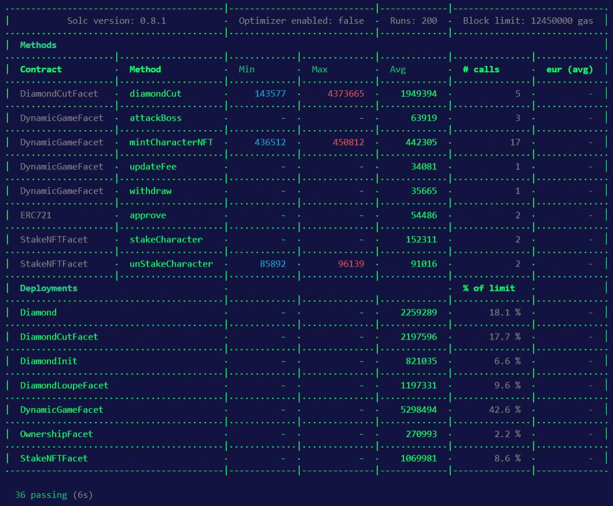
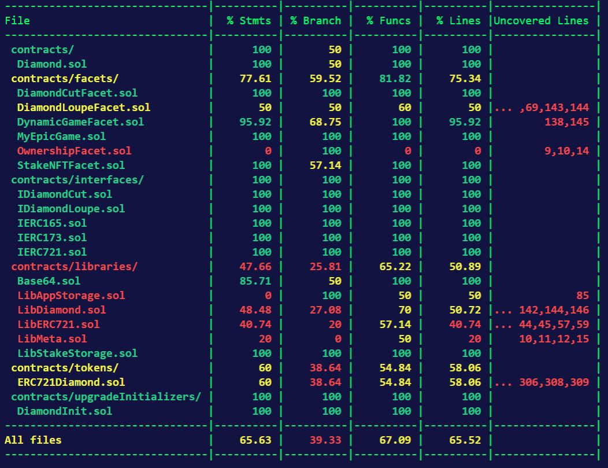
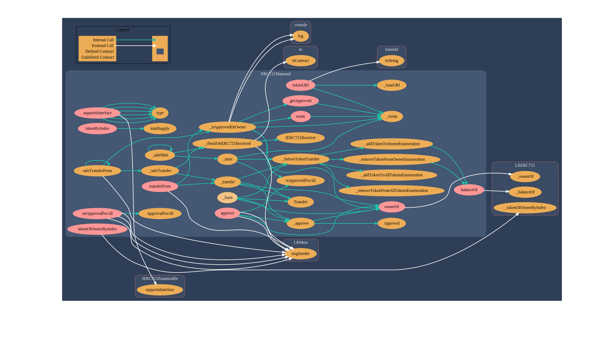
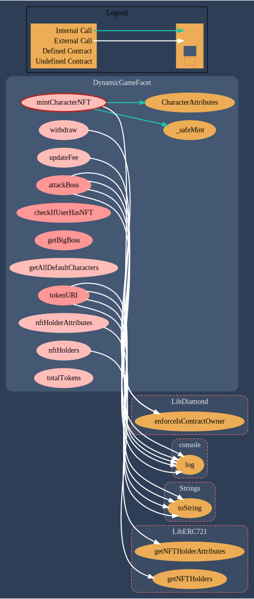
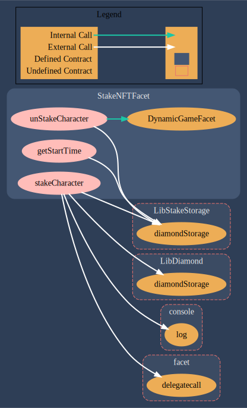

# 💎 Fullstack Dynamic NFT Mini Game🎮  💎Using Diamond Standard

### [Play On 💎🎮](http://diamond-dapp.vercel.app/) ⏩ http://diamond-dapp.vercel.app/

## Project Description 📝

### Fullstack Dynamic NFT Mini Game 🎮 Using Diamond Standard 💎 

- Player can connect to the mini game using Metamask on Mumbai Network
- Players can choose Valorant Heroes and mint them as an NFT
- Use the minted Hero NFT to battle against Thanos in the dapp
- Battling against Thanos changes the HP (On-Chain Metadata) of Hero NFT
- Players can heal their heroes by staking their Hero NFT in the dapp
- Staking NFTs increase the HP (On-Chain Metadata) of Hero NFT.
- Players can lend and rent NFTs from the Collateral-Free NFT Rental Marketplace
- Players can earn MATIC by lending their NFTs
- NFTs can be rented from the Rental Marketplace by specifying the rental duration and paying the rental amount in MATIC
- Players can use the rented NFTs to battle with Thanos
- Renters will not be able to transfer or stake the Rented NFTs
- Lenders can claim back the Lent NFTs from the renter once the rental period expires


## Project Demo GIF 🎥


## Directory Structure 📂
- `backend/contracts` ⏩ Smart Contract Code [Deployed @ Mumbai Test Network]
- `frontend` ⏩ Project's React frontend.
- `backend/test` ⏩ Tests for Smart Contracts.

## How Does Diamond Standard EIP 2535 Work ❓

### EIP-2535 💎 Diamond Standard 

A standard for organizing and upgrading a modular smart contract system.
Multi-Facet Proxies for full control over your upgrades.

Diamonds are a proxy pattern for Solidity development that allows a single gateway contract to proxy calls and storage to any number of other contracts. This provides a single interface for anyone to use your contracts, while allowing your feature set to grow into many contracts. The Diamond Standard also allows for replacing or extending functionality after your contracts are deployed.


## Run this project locally 🏃🏾‍♂️💨

```shell
git clone https://github.com/ShivaShanmuganathan/diamond-dapp
```

### Frontend 🎨🖌

- `cd frontend`
- `yarn install` Install Dependencies
- `yarn start` Start the frontend in localhost 
- Open `http://localhost:3000` <br />
We can use the localhost frontend to interact with the smart contract on Mumbai Network

### Backend 🔗

- `cd backend`
- `npm install` Install Dependencies
- `npx hardhat --version` Check if Hardhat is properly installed 
- `npx hardhat compile` Compile the Smart Contract
- `npx hardhat test` Test the Smart Contract Locally
- `npx hardhat run scripts/deploy.js` Deploy the Smart Contract Locally

### If you want to deploy it on Mumbai Network

1. Change filename `.env.example` to `.env`
2. Get Alchemy Key for Mumbai Network from Alchemy, and assign it to `STAGING_ALCHEMY_KEY` in `.env`
3. Get `PRIVATE_KEY` of your wallet from MetaMask, and assign it to `PRIVATE_KEY` in `.env`
4. RUN `npx hardhat run scripts/deploy.js --network mumbai` to deploy Diamond Contract, DiamondCutFacet, DiamondInit, DiamondLoupeFacet, and OwnershipFacet to the Mumbai Network. 
5. RUN `npx hardhat run scripts/deploy2.js --network mumbai` to deploy dynamicGameFacet Contract to the Mumbai Network, and add it to the Diamond Contract. 
6. RUN `npx hardhat run scripts/deploy3.js --network mumbai` to deploy nftReceiverFacet Contract to the Mumbai Network, and add it to the Diamond Contract. 
7. RUN `npx hardhat run scripts/deploy4.js --network mumbai` to deploy StakeNFTFacet Contract to the Mumbai Network, and add it to the Diamond Contract. 
8. RUN `npx hardhat run scripts/deploy5.js --network mumbai` to deploy StakeNFTFacet Contract to the Mumbai Network, and add it to the Diamond Contract. 

### How to make your own hero characters

- Open `scripts/deploy.js` in `backend` folder
- This is the code you need to edit to make your own heroes <br /> `let functionCall = diamondInit.interface.encodeFunctionData('init', [["Jett", "Phoenix", "Neon", "Raze", "Reyna", "Yoru", "Breach", "KAY/O", "Skye", "Sova", "Astra", "Brimstone", "Omen", "Viper", "Cypher", "Sage"],
  [
      "https://gateway.pinata.cloud/ipfs/QmXDEW26MnmgkdijbQtTQSnQZ7DWfMFqJYzruU3mGnp64w",
      "https://gateway.pinata.cloud/ipfs/QmWbkhC6AunE9ZZMwJbTbrHTPYFPCbY9uDFtLsSbr5zYt2",
      "https://gateway.pinata.cloud/ipfs/Qmc659ijRouVQEycT5rEwCo73j1QuaFLH1FMSTbDpTPueX",
      "https://gateway.pinata.cloud/ipfs/QmUpzvz2hC9gBYs5Tr1N3GqqiL9PstSkVR1cxmNKjC1FrU",
      "https://gateway.pinata.cloud/ipfs/QmWuzkZo4JLBvTo14LLCY7nP5oViifJt4oU5rpcd5QhHFH",
      "https://gateway.pinata.cloud/ipfs/QmUWYfyJDjMm65WGCNsrXqZdUGAA4Szt7A3wFaNZirfMqn",
      "https://gateway.pinata.cloud/ipfs/QmNwfv6rUgW3PCKnNo3uxLuy8r3hU9sGEd5TgoyQDLitTf",
      "https://gateway.pinata.cloud/ipfs/QmS6v2Gz22QSasUCmHg6gaMsUaWT2AvHVpKA4vefMf16u7",
      "https://gateway.pinata.cloud/ipfs/QmZqr3hj8RPeFeP6DGKi25KBTzTW5h4VWD2f6q94pXrJiA",
      "https://gateway.pinata.cloud/ipfs/QmPpbjrWbejguWRNP9qwgoPf6VYYfV4SUsZ51vvVMPbyTE",
      "https://gateway.pinata.cloud/ipfs/QmXHk7GYn7bgLRCig6zTEXpDvA5T8jTKqhXnyiiHEL5G8b",
      "https://gateway.pinata.cloud/ipfs/QmXrW7CdHC9UjJTAWuNU4vRAk7QdbjyHjewy3SGTD9DWms",
      "https://gateway.pinata.cloud/ipfs/QmP1R6xYmm77KdT8ZxUyixdA8uwCEHpmgDRBYCVSHMGc36",
      "https://gateway.pinata.cloud/ipfs/QmX3hV9q5k5B7mwsyj8g6q8qw8HPdkYTKuws6e73L997xQ",            
      "https://gateway.pinata.cloud/ipfs/QmPFbj4Ufx69zf241qJ5U4Qexqc8hx4PG5Uo5ucyuNW61X",            
      "https://gateway.pinata.cloud/ipfs/QmePF9pBnjdfajbT3i4peVoNqijaQCNYeLQXj76P7JoFXr"
  ],
  [1000, 1250, 1100, 1400, 1500, 1450, 1700, 1800, 1950, 2000, 2100, 2500, 2400, 3000, 3500, 4000],
  [45, 30, 35, 25, 15, 20, 60, 55, 50, 45, 80, 75, 70, 65, 100, 90],
  ["Duelists", "Duelists", "Duelists", "Duelists", "Duelists", "Duelists", "Initiators", "Initiators", "Initiators", "Initiators", "Controllers", "Controllers", "Controllers", "Controllers", "Sentinels", "Sentinels"],
  "THANOS",
  "https://raw.githubusercontent.com/ShivaShanmuganathan/diamond-nft-game/main/Thanos.webp",
  100000,
  150]);`
- Change `["Jett", "Phoenix", "Neon", ...]` to the character names you want
- Upload images you want to [IPFS using Pinata](https://www.pinata.cloud/) and get the CID of the uploaded images
- Change 
      `["https://gateway.pinata.cloud/ipfs/QmXDEW26MnmgkdijbQtTQSnQZ7DWfMFqJYzruU3mGnp64w",
      "https://gateway.pinata.cloud/ipfs/QmWbkhC6AunE9ZZMwJbTbrHTPYFPCbY9uDFtLsSbr5zYt2",
      "https://gateway.pinata.cloud/ipfs/Qmc659ijRouVQEycT5rEwCo73j1QuaFLH1FMSTbDpTPueX",
      ...]` to the CID of the images uploaded to IPFS
- Change `[1000, 1250, 1100, ...]` to the maxHealth you want for the Heroes
- Change `[45, 30, 35, ...]` to the attackDamage you want for the Heroes
- Change `THANOS` to the name of your Boss
- Change `https://raw.githubusercontent.com/ShivaShanmuganathan/diamond-nft-game/main/Thanos.webp"` to the image url of your Boss
- Change `100000` to edit the Boss Health
- Change `150` to edit the Boss Attack Damage

## Gas Report ⛽


## Test Coverage Report 🛸


## [ Project Walkthrough Video 📽](https://www.loom.com/share/56efd7906bc34d188a3e4b95fe96285d) 

[Video Link ](https://www.loom.com/share/56efd7906bc34d188a3e4b95fe96285d)


## Diamond Contract

### 💎 Diamond Proxy Contract Address 💎
[🚀 0x791B0E7e61B094Eb6B7695d9ABc659F391071c43 🛸](https://mumbai.polygonscan.com/address/0x791B0E7e61B094Eb6B7695d9ABc659F391071c43#code)

### Contracts in Project Structure
```
backend/contracts
├── Diamond.sol
├── facets
│   ├── DiamondCutFacet.sol
│   ├── DiamondLoupeFacet.sol
│   ├── DynamicGameFacet.sol
│   ├── NFTReceiverFacet.sol
│   ├── OwnershipFacet.sol
│   ├── RentalNFTFacet.sol
│   └── StakeNFTFacet.sol
├── interfaces
│   ├── IDiamondCut.sol
│   ├── IDiamondLoupe.sol
│   ├── IERC165.sol
│   ├── IERC173.sol
│   └── IERC721.sol
├── libraries
│   ├── Base64.sol
│   ├── LibAppStorage.sol
│   ├── LibDiamond.sol
│   ├── LibERC721.sol
│   ├── LibMeta.sol
│   ├── LibRentalStorage.sol
│   └── LibStakeStorage.sol
├── tokens
│   └── ERC721Diamond.sol
└── upgradeInitializers
    └── DiamondInit.sol
```


### Facet Addresses 🔮🌃

[💎 DiamondCutFacet deployed 🎯 0xd76553C411ed3b0a4792cEB04b71aEa5bE99eC15 🎯](https://mumbai.polygonscan.com/address/0xd76553C411ed3b0a4792cEB04b71aEa5bE99eC15#code)

[💎 DiamondInit deployed 🌠 0xd7842705839fF83570836705a4DDa434b821C944 🌠](https://mumbai.polygonscan.com/address/0xd7842705839fF83570836705a4DDa434b821C944#code)

[💎 DiamondLoupeFacet deployed 🔍 0xA794afc756a9115D3f7896977BB7B6b1164B3273 🔍](https://mumbai.polygonscan.com/address/0xA794afc756a9115D3f7896977BB7B6b1164B3273#code)

[💎 OwnershipFacet deployed 🏡 0xBB417f5335c149061cA18991eD51F0578c9cDB33 🏡](https://mumbai.polygonscan.com/address/0xBB417f5335c149061cA18991eD51F0578c9cDB33#code)

[💎 dynamicGameFacet deployed 🎮 0xf1FeF4915c6D2a73144a6f95239B971197DEAD9e 🎮](https://mumbai.polygonscan.com/address/0xf1FeF4915c6D2a73144a6f95239B971197DEAD9e#code)

[💎 nftReceiverFacet deployed 🛄 0x44243fC912be0827FD9A3e532F65e3450d15E513 🛄](https://mumbai.polygonscan.com/address/0x44243fC912be0827FD9A3e532F65e3450d15E513#code)

[💎 stakeNFTFacet deployed 🥩 0xC16919F426f58dB947234Acb20C454C06053FB4B 🥩](https://mumbai.polygonscan.com/address/0xC16919F426f58dB947234Acb20C454C06053FB4B#code)

[💎 rentalNFTFacet deployed 🛍 0xf53eAcceC787f532f5f25b778bde3910D5B8DA92 🛍](https://mumbai.polygonscan.com/address/0xf53eAcceC787f532f5f25b778bde3910D5B8DA92#code)


## Graph Images To Better Understand How Contract Works📊

### Diamond Graph


### ERC721Diamond Graph


### DynamicGameFacet Graph


### StakeNFTFacet Graph

